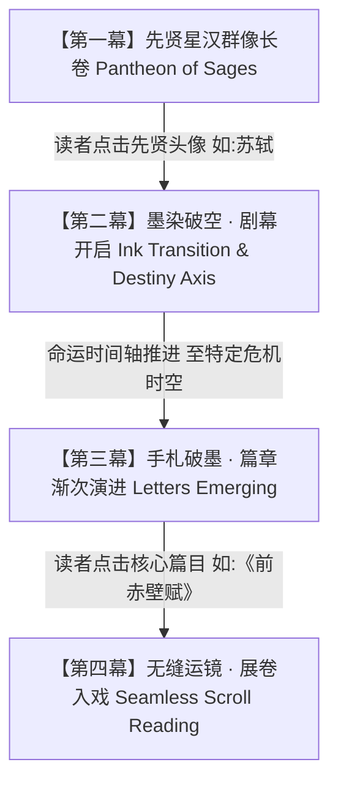

# 先贤星汉群像与交互式水墨短剧设计规范 (Interactive Theatrical Specification)

## 一、 设计哲学：文因人立，人因事显

传统的古典文学应用往往是“目录索引式”的（按卷一、卷二或按字词笔画机械罗列），把鲜活的千古人物矮化为冰冷的篇目检索表。

本项目打破这种机械范式，确立以 **“先贤宇宙（Author-Centric Pantheon）+ 交互式生命短剧（Interactive Dramaturgy）”** 为核心体验。让读者每一次开启阅读，都像在观看并参与一场**沉浸式东方水墨叙事短剧**。

---

## 二、 四幕式戏剧化叙事交互模型 (The 4-Act Cinematics)

### 第一幕：华夏先贤星汉长卷 (Act I: The Pantheon)
* **视觉呈现**：首页为一幅横向延展的澄心堂宣纸长卷，淡墨水纹缓缓流动，群贤毕至（左丘明、诸葛亮、韩愈、苏轼等工笔白描绣像微动）；
* **气场感知**：每位先贤配有其标志性字号与风骨印章（如苏轼之“东坡居士”、诸葛亮之“卧龙”、韩愈之“昌黎先生”）；
* **交互触发**：读者鼠标悬浮时画像泛起温润朱砂光晕，点击即触发戏剧转场。

### 第二幕：墨染破空 · 命运天命之轴 (Act II: Destiny Timeline)
* **运镜转场**：群像渐隐，浓墨如轻烟在宣纸上迅速晕染化开，伴随一声清越的古琴泛音；
* **舞台聚焦**：所选先贤画像升至主视觉中心，浮现其一生起伏跌宕的**“五大命途转折节点”**；
* **以苏轼为例的命途轴**：
  1. `1057年 (20岁)`：【嘉祐登科】—— 名动京师，欧阳修叹“老夫当避路，放他出一头地”；
  2. `1069年 (32岁)`：【熙宁漩涡】—— 王安石变法争锋，陈奏急政伤民，自请外任；
  3. `1079年 (42岁)`：【乌台死劫】—— 湖州被捕，百三十日御史台酷刑，生死边缘；
  4. `1080-1084年 (43~47岁)`：【黄州突围】—— 躬耕东坡，自愈自洽，精神极境；
  5. `1094-1100年 (57~63岁)`：【天涯儋州】—— 跨越南海，九死不悔，“问汝平生功业，黄州惠州儋州”。

### 第三幕：手札破墨 · 篇章渐次演进 (Act III: Works Emerging Like Letters)
* **时空情境具象化**：当镜头推进至某个命运节点（如“黄州突围”），背景浮现黄州夜江平远山水与孤舟微澜；
* **信札渐次浮现**：该历史节点诞生的经典篇章，不是死板的列表，而是**犹如当年从东坡书案上飞出的信札墨迹**，伴随水墨微动渐次浮现：
  * `元丰五年七月` ➔ **《前赤壁赋》**（清风明月，水月齐物哲学突围）；
  * `元丰五年十月` ➔ **《后赤壁赋》**（江流有声，孤鹤横江道家幽微）；
  * `元丰六年十月` ➔ **《记承天寺夜游》**（月色如水，但少闲人如吾两人）。
* **篇目卡片信息**：每张信札标注文体、写作精确时间、心境状态标签与名家第一句点题。

### 第四幕：无缝运镜 · 展卷入戏 (Act IV: Entering the Scroll)
* 读者点击任意篇目信札（如《前赤壁赋》），界面产生镜头推进（Camera Zoom-in）特效，无缝平滑展开自右向左的古典竖排水墨长卷，进入深度研读状态。

---

## 三、 先贤生命剧场示例库 (Dramaturgical Scripts)

| 先贤名称 | 时代与风骨 | 核心生命短剧命途节点 | 关联代表作手札 |
| :--- | :--- | :--- | :--- |
| **苏轼 (东坡居士)** | 北宋 · 旷达突围 | 嘉祐登科 ➔ 熙宁党争 ➔ 乌台死劫 ➔ **黄州突围** ➔ 惠儋天涯 | 《前赤壁赋》《后赤壁赋》《记承天寺夜游》《喜雨亭记》 |
| **诸葛亮 (卧龙先生)** | 三国 · 忠贞悲壮 | 躬耕隆中 ➔ 三顾出山 ➔ 白帝托孤 ➔ 平定南中 ➔ **汉中誓师** | 《出师表》《后出师表》《诫子书》 |
| **韩愈 (昌黎先生)** | 中唐 · 硬骨至情 | 孤苦依兄 ➔ 贞元及第 ➔ 谏迎佛骨 ➔ 贬谪潮州 ➔ **家族丧乱** | 《祭十二郎文》《师说》《进学解》《送穷文》 |
| **左丘明 (春秋盲史)** | 先秦 · 史家之祖 | 春秋周室衰微 ➔ 诸侯争霸 ➔ 齐鲁长勺决战 ➔ **微言大义修史** | 《曹刿论战》《郑伯克段于鄢》《子鱼论战》 |

---

## 四、 动画曲线与视听规范 (Cinematics & Audio Specs)

* **运镜缓动曲线（Easing）**：采用仿古典水墨扩散的缓入缓出曲线 `cubic-bezier(0.25, 1, 0.5, 1)`；
* **转场时长**：
  * 先贤群像聚散转场：`600ms`；
  * 命运轴展开与信札浮现：`800ms`（错峰依次浮现，间隔 `150ms`）；
* **配乐音效（R2 音频驱动）**：
  * 点击先贤头像：古琴清冷泛音（`guqin-pluck.mp3`）；
  * 篇章手札浮现：宣纸展卷沙沙微声（`paper-unroll.mp3`）。
