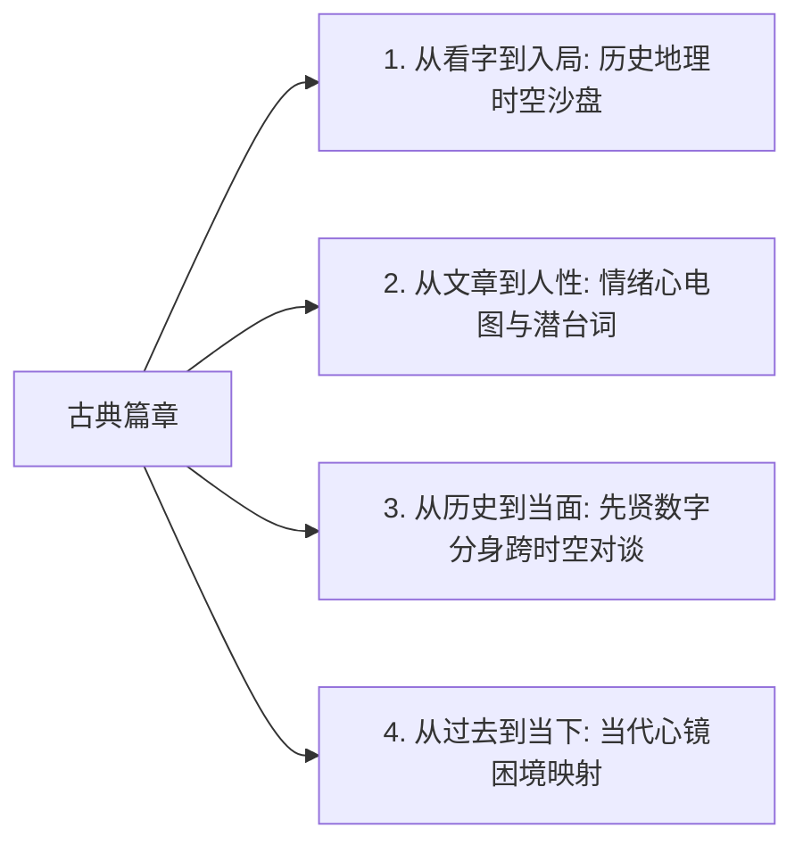

# 项目愿景：文止于此，人观不止 (Vision & Core Philosophy)

> **“文止于此，人观不止。”**  
> 《古文观止》是清代吴楚材、吴调侯选编的千古经典。“观止”二字，本意是“赞叹文章之美已达顶峰，观止于此”。  
> 然而在我们的项目中，**文字虽有篇幅的终章，但文字背后人的命运、时代的情感、民族的风骨，却永无止境。**

---

## 一、 核心痛点与问题反思

市面上现有的古文软件与典籍网站，99% 都停留于传统的**“字词注释 + 白话翻译 + 课后背诵”**模式：
1. **只见死字，不见活人**：把苏轼、诸葛亮、韩愈简化为冰冷的应试考点，忽略了他们在特定历史时刻作为“凡人”的挣扎、恐惧、迷茫与突围。
2. **割裂时空与地理现场**：读者读《前赤壁赋》，不知黄州赤鼻矶的真实地貌与江心水流；读《出师表》，不知蜀道行军之险峻与益州民力之极限。
3. **缺乏现代心理共鸣**：古人的至痛与自愈（如苏轼的职场崩塌与精神重建、韩愈的至亲早夭自责），与当代人的精神内耗有着惊人的一致性，但传统工具未能搭建这座跨越千年的心灵之桥。

---

## 二、 “观不止”的四大突围维度

1. **时空与地理重构**：
   - 每一个篇章挂载精准的历史地理坐标（古地名与今地名映射、经纬度沙盘）；
   - 还原作者动笔时的微观物理环境（江上扁舟、汉中军营、汴州陋室）。
2. **心理起伏与潜台词剖析（Subtext）**：
   - 揭示字面背后的潜意识与心理防御机制（如《前赤壁赋》看似神仙逍遥，实则是乌台劫后的自我疗愈）。
3. **先贤数字分身（Persona Agent）**：
   - 基于严格文集、年谱限定语料的先贤数字人格，让读者能跨越千年向东坡、诸葛武侯倾诉人生困惑并获其回应。
4. **当代心镜共鸣（Modern Resonance）**：
   - 提炼先贤绝境突围的处世哲学，为当代人化解职场内耗、生存焦虑与亲情离散提供精神药方。
