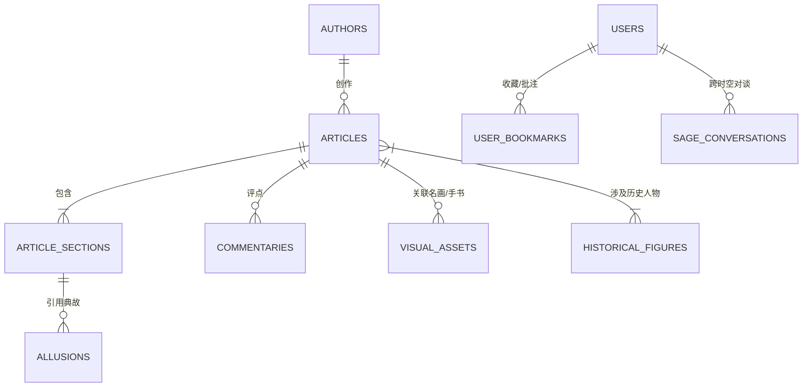

# Cloudflare D1 边缘数据库模型设计 (Database Specification)

## 一、 D1 数据库架构与分层 ID 策略

### 1. 技术优势
* **读多写少（Read-Heavy）极速响应**：D1 借助 Cloudflare Edge 全局分布式只读副本（Read Replication），读者在世界任何地方均以毫秒级延迟调阅古文段落、字词注、典故考据与名家评点。
* **严格 ISO 8601 时间戳规范**：采用标准 `TEXT`（如 `'1082-10-15T00:00:00.000Z'` 或先秦负年份 `'-0684-03-15T00:00:00.000Z'`），原生支持 `datetime()` 索引与比较。
* **FTS5 全文检索**：原生支持古文字词、通假字与评语的高性能全文检索。

### 2. 双轨分层 ID 规范 (Layered ID Standard)
* **静态典籍知识层（作者、篇目、段落、典故）**：
  采用 **语义化 Slug ID**（如 `su-shi`、`chibifu-qian`、`chibifu-qian-1`），天然适配 RESTful 路由、Next.js SSG 静态生成、SEO 爬虫收录与 R2 图片资产路径直观对应。
* **动态交互与衍生数据层（AI 先贤对话、读者随手批注、阅读历史）**：
  采用 **标准 UUIDv7**（如 `018d9b1a-...`），保证分布式高并发写入性能与时间序索引。

---

## 二、 实体关系模型（ER Diagram）

---

## 三、 10 大核心表结构定义与索引

表结构 DDL 及复合索引定义统一维护于版本化迁移文件中：
* 参见 **[migrations/0001_initial_schema.sql](file:///c:/DavidCode/Beyond-the-Endless-Classics/migrations/0001_initial_schema.sql)**：
  1. `authors`（先贤作者表）
  2. `articles`（经典篇目表）
  3. `article_sections`（篇章段落表）
  4. `allusions`（典故考据表）
  5. `historical_figures`（涉及历史人物表）
  6. `commentaries`（历代名家评点表）
  7. `visual_assets`（视觉资产元数据表）
  8. `users`（Firebase Google 用户映射表）
  9. `user_bookmarks`（读者收藏与朱批表）
  10. `sage_conversations`（先贤对谈消息流表）
