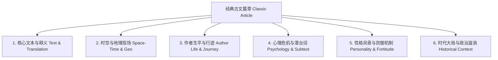

# 《古文观止·观不止》系统设计与架构规范 (System Architecture)

## 1. 领域认知模型（六维全景模型）

为实现“超越文本”，系统将每一篇典籍拆解为 **六大时空与生命维度**：



---

## 2. 前后端一体 Monorepo 架构设计

项目采用标准严谨的 **`apps/web` (前端) + `apps/api` (后端) + `packages/` (共享包)** Monorepo 体系：

```
Beyond-the-Endless-Classics/ (Monorepo Root)
├── apps/
│   ├── web/                         # 【前端】Next.js (React 19) 水墨手卷应用
│   │   ├── src/app/                 # 页面路由 (多语言 /[locale]/article/[slug])
│   │   ├── src/components/          # 竖排水墨手卷、素绢折页、时空沙盘与先贤对谈 UI
│   │   └── src/lib/api-client.ts    # 强类型 API 客户端 (调用后端 api)
│   │
│   └── api/                         # 【后端】Cloudflare Worker / Hono 极速后端服务
│       ├── src/routes/              # RESTful API 路由 (articles, authors, chat, user)
│       ├── src/middleware/          # Firebase Auth JWT 鉴权中间件
│       └── src/services/            # 核心业务 (D1 数据库操作、先贤 RAG 对话流)
│
├── packages/                        # 【前后端公共共享包】
│   ├── types/                       # 领域实体与 API 端到端共享类型定义 (HistoricalTime 等)
│   ├── database/                    # Cloudflare D1 数据模型、Drizzle 客户端与驱动
│   └── sage-ai/                     # 先贤数字分身 Persona Prompt 引擎与 RAG 检索
│
├── migrations/                      # Cloudflare D1 版本化迁移脚本 (0001_initial, 0002_seed)
└── docs/                            # 官方技术文档库与全要素规范
```

---

## 3. 核心技术选型一览

* **全栈架构模式**：独立 `apps/web` (前端) + `apps/api` (后端) Monorepo 体系
* **多语言国际化 (i18n)**：
  * **简体中文 (zh-Hans)** 与 **正体/繁体中文 (zh-Hant)** 实时平滑切换；
  * 核心古典原文与朱批保留正体书法韵味，支持词库级繁简转换；
  * 采用 `next-intl` 语义化国际化路由（如 `/:locale/article/:slug`），兼顾全局 SEO。
* **样式与古典美学**：
  * **画境灵魂**：郭熙《林泉高致》之平远水墨气象与烟云变灭；
  * **空间留白**：倪瓒“去容器化（Borderless）”逸韵，彻底拆除现代网页卡片外框，文字直接落墨于北宋澄心堂古宣；
  * **版式规范**：中国古典自右向左竖排手卷（`writing-mode: vertical-rl`）、朱丝栏、名家钤印款识与宋代素绢折页手札交互。
* **用户认证体系**：
  * **Firebase Auth (Google OAuth 2.0)**：客户端一键唤起 Google 授权，服务端/边缘端验证 Firebase JWT Token；
  * 与 D1 `users` 表通过 `firebase_uid` 保持 1:1 映射，跨设备同步个人研读心得、朱批书签与先贤对谈记录。
* **数据与存储底座**：
  * **Cloudflare D1**：分布式边缘 SQLite，承载 10 大核心表，双轨分层 ID 策略（静态语义 Slug + 动态 UUID）；
  * **Cloudflare R2**：托管海量历代名画、先贤画像、书法碑拓切片、场景音频与视频（零出站流量费）。
* **先贤智能体引擎**：
  * 严谨史料限定的 System Prompt + 篇目段落上下文注入，提供第一人称先贤跨时空对谈。
