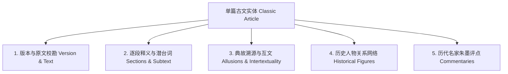

# 《古文观止·观不止》文本知识工程规范 (Knowledge Specification)

## 一、 规范概述与核心理念

正如 [vision.md](file:///c:/DavidCode/Beyond-the-Endless-Classics/docs/01-product/vision.md) 所确立的宗旨：“**文止于此，人观不止**”。
为确保全量 222 篇典籍在数字化重构过程中的**学术严谨性、结构统一性与生命温度**，特制定本规范。所有数据录入与先贤考据均须严格遵循本标准。

---

## 二、 文本知识工程全要素标准 (5 大维度)

每篇古文由 **5 大结构化知识层** 组成：

### 1. 原文版本与校勘标准 (Version & Text)
* **底本依据**：默认采用清康熙三十四年（1695年）吴楚材、吴调侯编选的**《古文观止》原刻本**为第一底本；若存在异文，以中华书局标点本或宋元刻本为校勘本。
* **字词规范**：
  * 通假字必须标注本字（如“冯虚御风”之“冯”通“凭”）；
  * 生僻字与多音字必须提供拼音与古代声律读音（如“举酒属客”之“属 zhǔ”）；
  * 句读遵循现代标点规范，同时保留古典断句气口。

### 2. 篇章段落与潜台词心境 (Sections & Subtext)
每个自然段落（`article_sections`）必须包含：
* `subtitle`：4~8 字的工笔意境小题（如“清风徐来 · 水月初升”）；
* `original_text`：校勘后的竖排段落正文；
* `translation`：信达雅的现代白话精译；
* `subtext`（潜台词）：**超越字面意思的深层心理剖析**（揭示作者下笔时的潜意识动机、政治防御机制或情感压抑）；
* `emotion_tag` & `emotion_score`：情绪状态标签与心境指数（区间 `-100` 至 `+100`，如悲极 `-100`、超脱 `+95`）；
* `sage_monologue`：第一人称先贤随笔心语（用于对谈与随行解析）。

### 3. 典故考释与跨时空互文 (Allusions & Intertextuality)
古文“无一字无来历”，每篇需考据 3~8 个核心典故：
* `term`：典故词条（如“望美人兮天一方”、“肉食者鄙”）；
* `source_book`：原典出处（如《楚辞·离骚》、《庄子·齐物论》、《左传》）；
* `source_quote`：原典上下文金句；
* `explanation`：文学隐喻、政治寄托与哲学内涵深度考释。

### 4. 历史人物图谱 (Historical Figures)
* 区分 **当场人物**（同行者、论辩者）、**怀古人物**（诗中评点之古人）、**时代暗线人物**（君王、权臣、政敌、宗亲）；
* 记录其历史真实身份及在篇章中构成的张力关系。

### 5. 历代名家朱墨评点 (Commentaries)
* 汇集 **宋、元、明、清乃至现当代名家** 的真知灼见；
* 必录项：清·吴楚材《古文观止》原评；
* 选录项：明·茅坤（茅鹿门）《唐宋八大家文钞》、明·金圣叹评点、清·林云铭《古文析义》等；
* 评点类型区分为：`'朱批'`（段内批注）、`'夹注'`（双行小字注）、`'总评'`（篇末大评）。

---

## 三、 时间与地理多维归一化规范

### 1. 时间处理准则
* **内部 ISO 8601 标准时间（`written_iso`）**：
  * 公元后时间：严格遵循 `YYYY-MM-DDTHH:mm:ss.sssZ`（如 `1082-10-15T00:00:00.000Z`）；
  * 公元前时间：遵循 ISO 8601 扩展前缀 `-YYYY-MM-DDTHH:mm:ss.sssZ`（如公元前684年写作 `-0684-03-15T00:00:00.000Z`）。
* **中国传统历法描述（`lunar_calendar_desc`）**：
  * 朝代 + 帝王年号纪年 + 干支纪年 + 农历月份与既望描述（如 `“宋神宗元丰五年七月既望 (壬戌)”`）。

### 2. 地理坐标与古今地名映射
* 必须包含 `location_ancient`（古代地名）、`location_modern`（现代精准行政区划与遗址公园）；
* 必须包含 `longitude`（经度）、`latitude`（纬度），坐标系采用 WGS84 标准，便于在地图沙盘中精准联动。
